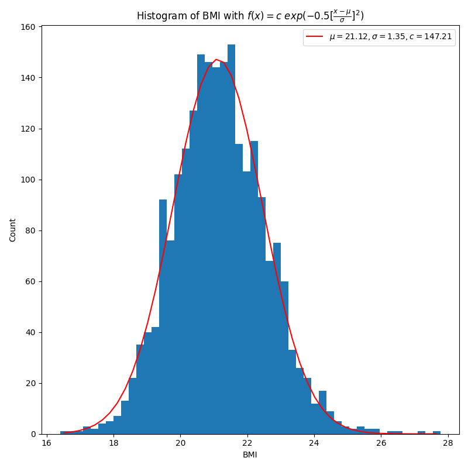

# Overview

This repo collects the data from [procyclingstats](https://www.procyclingstats.com/rankings.php).
It uses machine learning to analyze the pro cyclists and predict the race outcome.

# Intro
Each rider can earn points according to the rank in a race. There are two scoring system, UCI and PCS.
UCI (Union Cycliste Internationale) is an organization for sports cycling. PCS (ProCyclingStats) is a public website that collects the race results, and have their own scoring system.

There are different specialty of races, such as GC (General Classification), TT (Time Trial), Sprint, and Climber. Riders can earn points for the specialty they participate in. Basically we can treat "points per specialty" as riders' performance.

[source](https://www.procyclingstats.com/rider/wout-van-aert)

# Data analysis

## Rider birth place
Each dot in the figure show a birthplace of a rider. Europeans dominate the population

## Rider BMI histogram

## Rider points per specialty correlation

## PCA on the performance points
We do PCA analysis on points per specialty. 5 variables can be shrink to 3 variables for just 7% loss.

Afterwards we can cluster the riders based on the 3 PCA eigenvectors (3D graph)

<!-- seems not to work -->
<head>
  <link rel="import" href="./reports/figures/riders_PCA.html">
</head>

# Model strucutre
There are a few models in src/models/train_model.py, including

- Average: average over ranking
- Linear: linear regression on dates vs ranking
- XGBoost: 5 trees, 6 max depth
- LightGBM: 16 trees, 6 max depth
- NN: 1 linear layer, equivalently to linear regression on (dates, distance) vs ranking
- DNN: 3 linear layers
- RNN: 8 layers

## Model prediction

# Todos
- [x] Tweak the model parameters
- [x] Build RF type models
- [x] fetch the rider's data, like height, points per specialty
- [x] Visualize the data
- [ ] Setup a database for data storage (seems not necessary)